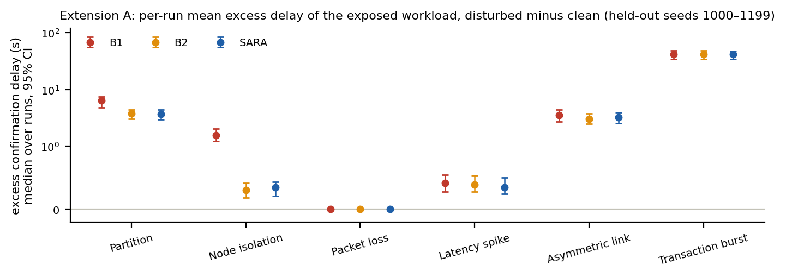
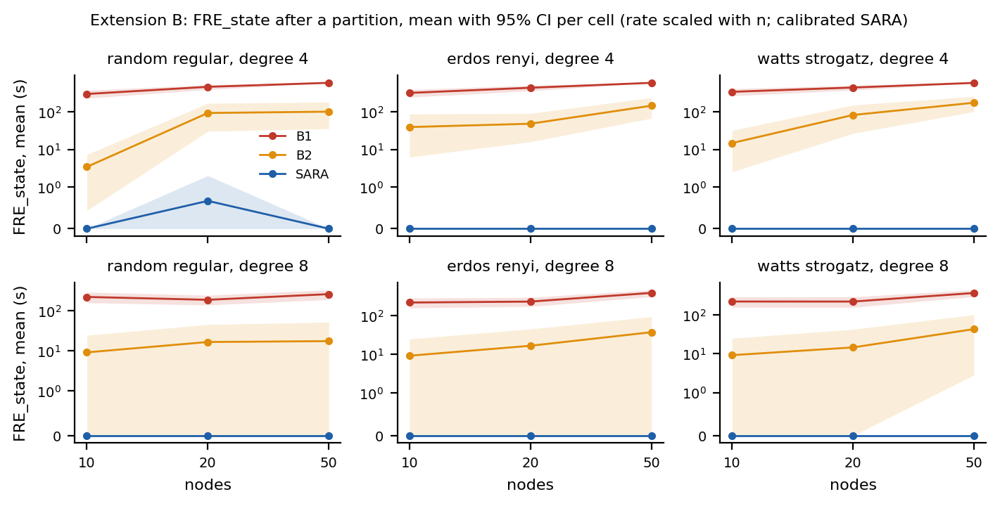
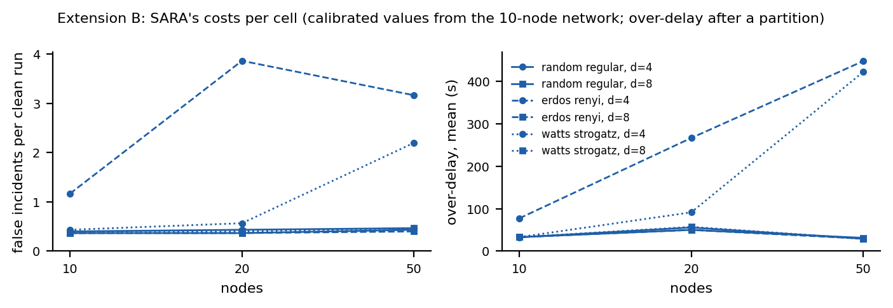
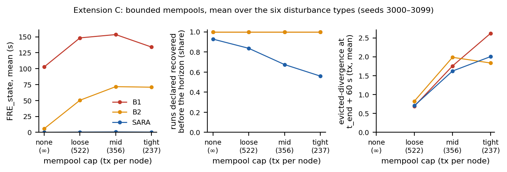

# Extension experiments (separate from the main study)

The Phase 1–4 study is frozen: held-out seeds 1000–1199, sweeps on 2000–2049, calibration on dev seeds 0–4,
results in `results/numbers.json`, `results/sweeps.json` and `results/RESULTS.md`, hand-verified in
`results/verification.json`. Nothing here changes, replaces or re-tunes it. Every model feature added for these
extensions is off by default; with defaults every run is bit-for-bit identical to the runs before the extensions
(`tests/test_regression.py` replays a snapshot of 40 runs recorded before any code was edited).

<!-- PREREG:BEGIN -->
## Pre-registration (written before any extension experiment was run)

Common rules for all three extensions:

- SARA keeps its pre-specified calibrated values in every primary result: tau_m = 6.47 s, eps_D = 0.0
  (resolution floor 2 / (N·|R|) applies), beta = 5.7235 blocks, eps_size = 0.125 (`results/dev/calibration.json`).
  A re-calibrated SARA appears only in Extension B, only as a clearly labelled secondary result.
- Statistics follow the main study (`experiments/analyze.py`, reused unchanged): paired two-sided Wilcoxon
  signed-rank (zero differences dropped), Holm correction within each table (family), matched-pairs rank-biserial
  r, median paired difference with a 2000-resample bootstrap 95% CI. "Pooled" averages each seed over the
  disturbance types first, so there is one pair per seed. Descriptive means carry a 2000-resample bootstrap 95% CI.
- Everything reported is computed by `experiments/ext_analyze.py` from the stored run tables
  (`results/extensions/ext_*_runs.csv`) and written to `results/extensions/ext_numbers.json`.
- Extension seeds are 3000–3099. Extension A is the one exception, explained below.

### Extension A: confirmation delay and block composition (user-visible harm)

**Audit of what is recorded.** `mh/metrics.py` and `mh/runner.py` keep, per run, only summaries of the
post-recovery workload (shared-workload transactions created in [t_end, t_end + 300 s)): mean and p95
confirmation latency, the number unconfirmed, and mean propagation latency. The per-seed pickles in
`results/raw/main/` (which held per-transaction latencies for that window only) are not on disk; only
`results/all_runs.csv` (per-run metrics) is stored. Confirmation times of transactions created before or during the
disturbance and block contents were never recorded. **So Extension A re-simulates.** It re-runs the main study's
B1, B2 and SARA runs with the unchanged calibrated configuration on the held-out seeds 1000–1199 (the runs whose
recovery verdicts the main study reports; runs are deterministic, so these are the same runs, and every re-run is
checked against `results/all_runs.csv`), plus the clean B1 history per seed. This is the exception to "new seeds":
Extension A measures more quantities of the existing runs, it is not a new configuration. As a replication on fresh
seeds, the identical analysis is also run on seeds 3000–3099.

**Definitions.**
1. *Confirmation delay* of a transaction = mining time of the block that includes it on the final best chain
   (at the horizon, 960 s) minus its creation time. A transaction not on the final best chain is *never confirmed
   within the horizon*; for averages its delay is censored at (960 s − creation time).
2. Creation-time windows: *before* = [300 − 120, 300) s, *during* = [300, t_end), *after* = [t_end, t_end + 300),
   *exposed* = their union [180, t_end + 300). t_end = 360 s (330 s for the burst). Only shared-workload
   transactions (identical ids, creation times, origins and fees in both histories) are used; burst extras are
   reported separately (count and never-confirmed count).
3. Per window and run: number of transactions, number never confirmed, mean / median / p95 delay of the confirmed
   ones, and the censored mean.
4. *Excess delay* of a transaction = its censored delay in the disturbed run minus its censored delay in the paired
   clean run (same seed, same id). Per run: mean, median and p95 over the window, share with excess > 0, and
   *never-confirmed extra* = transactions confirmed in the clean history but not in the disturbed one.
5. *Block-composition distance* (BCD) = 1 − |Cd ∩ Cc| / |Cd ∪ Cc|, where Ch is the set of shared-workload
   transactions in the blocks of history h's final best chain mined in [t_end, t_end + 300). The mining schedule
   (times and miners) is identical in both histories, so BCD is 0 when the disturbance changed nothing. Also
   reported: *displaced* = |Cc \ Cd| and *added* = |Cd \ Cc|.

**Primary outcome:** per-run mean excess delay over the exposed window.

**Analysis.**
- A1 (harm vs the clean history): for each policy and disturbance, the per-run primary outcome against 0 (paired
  Wilcoxon of disturbed vs clean censored mean delay); one Holm family of 18 tests.
- A2 (policies): SARA vs B1 and SARA vs B2 on the primary outcome, per disturbance and pooled; one Holm family
  of 14 tests. Secondary families, same layout: during-window and after-window mean excess, BCD, never-confirmed
  extra (exposed window).
- A3 (association): Spearman rank correlation across runs between FRE_state and the primary outcome, within each
  disturbance for B1 and for B2. Descriptive; p values unadjusted.
- Key question, "does a policy that declares recovery falsely also leave users worse off?": answered yes for a
  disturbance if SARA − B1 (and separately SARA − B2) on the primary outcome has a negative median paired
  difference with Holm p < 0.05 in A2.

**Hypotheses.** H-A1: B1's primary outcome is > 0 for partition, isolation and asymmetric (residue delays the
transactions that miners lacking them cannot include). H-A2: the burst has the largest excess delay for every
policy (backlog debt, no residue, nothing for any policy to repair). H-A3: SARA and B2 have a lower primary outcome
than B1 for partition, isolation and asymmetric; SARA vs B2 differs little. H-A4: within B1, Spearman ρ between
FRE_state and the primary outcome is > 0. Expected null: packet loss ≈ 0.

**What it can and cannot show.** B1 takes no action, so a difference between B1 and SARA is caused by SARA's
reconciliation, not by the declaration itself; the extension tests whether false certification *coincides* with
user harm, not whether declaring causes harm.

### Extension B: scale and topology robustness

**Model change.** `SimConfig.topology` selects the seed-fixed peer graph (default `"random_regular"`, the main
study's random 4-regular graph, drawn exactly as before). Added: `"erdos_renyi"` (G(n, p) with p = degree / (n − 1),
redrawn until connected) and `"watts_strogatz"` (ring lattice with k = degree neighbours, each edge rewired with
probability `ws_rewire` = 0.1, redrawn until connected). Link latencies are drawn as before.

**Runtime cap.** One partition run at n = 100 (random regular, degree 4, rate scaled as below) took 275 s under B1
and 176 s under B2 on this machine (i5-13500H), far above about 1 minute, so n = 100 is excluded; the largest
networks have 50 nodes (8–18 s per run).

**Cells.**
- Scaled load (primary): topology ∈ {random_regular, erdos_renyi, watts_strogatz} × n ∈ {10, 20, 50} ×
  degree ∈ {4, 8} = 18 cells, with tx_rate = 0.4·n tx/s (constant load per node; 4.0 at n = 10) and
  block_capacity = 8·n, so block-space utilisation stays at the calibrated 0.75. (Deviation, stated up front:
  keeping block_capacity at 80 would put the 50-node cell at 3.75× capacity, an unbounded backlog in which no
  history ever recovers, which tests overload rather than scale.)
- Fixed total rate: random_regular, degree 4, n ∈ {20, 50} with tx_rate = 4.0 and block_capacity = 80
  (n = 10 is the same as the scaled cell).
- Every other setting is the calibrated main configuration, including SARA's calibrated values.
- Disturbances: partition, isolation, asymmetric (the three types with substantial residue in the main study; loss
  and burst leave none). Policies B1, B2, SARA, plus per seed the clean B1 history (backlog counterfactual) and the
  clean SARA history (false incidents).
- Seeds 3000–3029 (30 per cell).

**Outcomes per cell.** Residue size (B1 residue AUC and residue 10 s after t_end, median); share of runs certified
recovered while residue remained (FRE_state > 0) per policy; FRE_state mean per policy; SARA over-delay mean; SARA
false incidents per clean run and share of clean runs with any. Paired Wilcoxon SARA vs B1 and SARA vs B2 on the
per-seed mean FRE_state over the three disturbances, one Holm family over all cells and both comparisons; same for
over-delay (SARA vs B2). SARA's advantage *reverses* in a cell if its mean FRE_state exceeds B2's, and *shrinks* if
the SARA − B2 difference is not significant after Holm.

**Secondary (re-calibrated SARA, labelled as such).** For every cell other than the main configuration, SARA is
re-calibrated on dev seeds 0–4 with `experiments/calibrate.calibrate(cell config)` and its clean and disturbed
runs are repeated on the same seeds. Reported next to, never instead of, the calibrated SARA.

**Hypotheses.** H-B1: B1 certifies recovery while residue remains in ≥ 90% of partition and isolation runs in every
cell. H-B2: SARA's mean FRE_state is below B1's and B2's in every cell. H-B3: with the n = 10 calibration fixed,
SARA's false-incident rate and over-delay grow with n and degree (its costs, not its accuracy, degrade). H-B4: at
fixed total rate, residue is smaller than at the scaled rate for the same n.

### Extension C: bounded mempools and eviction

**Model change (off unless `mempool_cap` is set).** `SimConfig.mempool_cap` = maximum pending transactions per node
(None = unlimited, the main study). Simplified from Bitcoin Core's mempool limiting (TrimToSize, the rolling minimum
fee rate, the recent-rejects filter):
1. A node ignores a transaction it has already seen: pending, confirmed, or previously evicted or rejected. The
   last two are the *recently-rejected memory*, so a peer's later announcement, a B2 resync or a SARA pull of such a
   transaction is not accepted.
2. A transaction whose fee rate is below the node's rolling minimum fee rate is rejected.
3. If the mempool is full, the transaction is accepted only if its fee rate beats the lowest one held; that one is
   evicted. Otherwise the newcomer is rejected (in Core it would enter and be trimmed straight back out).
4. The rolling minimum fee rate rises to the fee rate of every transaction evicted or rejected as in step 3. It
   does not decay (Core's half-life is 12 hours, against a 960 s run) and there is no incremental relay fee (fee
   rates are continuous).
5. Transactions returned to the mempool by a reorg are re-added as before and the mempool is then trimmed back to
   the cap, evicting the lowest fee rates (Core: re-add after a reorg, then limit the mempool size).
6. A node serves (to a pull or a resync) only transactions it holds, pending or confirmed, not ones it evicted.
Fee rate = the existing per-transaction fee (lognormal, all transactions are 250 bytes).

**SARA and transactions a node would refuse again.** A pull is an operator-directed submission, so the node's
verdict is visible. When a node refuses a delivered transaction (steps 1–3), SARA marks that (node, transaction)
gap *unrepairable*, never pulls it again (so reconciliation cannot loop), and logs an escalation ("refused by node
policy, operator action required"). It keeps the gap in its divergence measure: it does not hide unrepaired state,
so the incident stays open and the existing persistence escalation raises the risk tier. SARA declares recovery only
if the divergence clears by other means (the transaction is mined, or every holder evicts it). B1 and B2 are
unchanged.

**Ground truth.** The residue definition is unchanged. Added, only when a cap is set, at every evaluator sample:
- *evicted-divergence* EvDiv(t): transactions of the residue candidate set (pending somewhere, mature, created before
  t_end) that some node lacks (neither pending nor confirmed) *because it evicted or rejected them*;
- *gossip residue* GRes(t): candidate transactions some node lacks without ever having dropped them (Res = EvDiv ∪
  GRes);
- *lost*: mature transactions some node dropped that are now pending nowhere and not on the best chain;
- largest per-node mempool and the number of nodes at the cap.

**Cap levels.** From clean-run backlog statistics on dev seeds 0–4 only (clean B1 histories with the calibrated
configuration, per-node mempool size sampled every 1 s over [0, 960] s): M = the largest per-node mempool size seen.
Caps: *loose* = ceil(1.10·M) (just above the clean maximum), *mid* = ceil(0.75·M), *tight* = ceil(0.50·M), and
*none* (reference, the main configuration on the extension seeds). The values are computed by
`experiments/ext_c_capacity.py --calibrate` and recorded in the change log below before any extension run.

**Runs.** Seeds 3000–3099; all six disturbances; B1, B2, SARA; per seed and cap the clean B1 and clean SARA
histories. Assertion: every clean run with zero evictions and zero rejections must show zero residue and zero
evicted-divergence at every sample (the experiment stops if not).

**Outcomes.** Evictions and rejections per run; EvDiv at t_end + 10, + 60 and + 300 s and at the horizon, its AUC
over [t_end, t_end + 600], share of runs with EvDiv > 0 at + 300 s, time until EvDiv is 0 for 10 s (censored
share); GRes at the same instants; lost transactions; FRE_state under the unchanged residue definition per policy;
SARA: state alarm raised, recovery declared before the horizon (share), over-delay, unrepairable gaps, highest risk
tier after t_end and share of post-t_end audits at HIGH or above; clean runs: evictions, residue, EvDiv, SARA false
incidents per run. Paired Wilcoxon SARA vs B1 and SARA vs B2 on FRE_state per cap and disturbance, one Holm family.

**Hypotheses.** H-C1: at the loose cap, clean runs (almost) never evict and every clean run without evictions shows
zero residue and zero EvDiv. H-C2: disturbances that build backlog (burst, partition, asymmetric) make capped nodes
evict, and EvDiv persists after connectivity returns. H-C3: neither gossip, B2's resync nor SARA's pulls clear
EvDiv. H-C4: SARA detects it, cannot clear it, escalates and does not certify recovery while it remains (FRE_state
near 0, large over-delay or no declaration); B1 and B2 certify recovery while it remains (FRE_state > 0). H-C5: at
tighter caps clean runs evict too and SARA opens false incidents in clean runs.

### Hand verification

`experiments/ext_verify_by_hand.py` recomputes, with deliberately naive code that shares nothing with
`mh/ext_metrics.py` or the eviction code, (1) confirmation delays of one held-out run (seed 1000, partition, B1)
and its paired clean run, and (2) every eviction at one node in one capped run, checked against the rule above at
the moment it happened. Output: `results/extensions/verification_ext.json`.
<!-- PREREG:END -->

## Change log (append-only; every change after pre-registration, with the reason)

- 2026-10-05 12:21. Extension C cap values, computed with the pre-registered rule (not a change of definition)
  before any Extension C run: on dev seeds 0–4 the largest per-node mempool size in clean B1 histories is
  M = 474 transactions (`results/extensions/ext_c_cap_calibration.json`), so loose = 522, mid = 356, tight = 237.
- 2026-10-05 13:12. Extension B scope reduced for compute time, before any Extension B result was looked at.
  Under full load (14 processes, laptop CPU throttled) a 50-node, degree-8 job (11 runs) took 20–41 min, about 9×
  slower per run than unloaded. Profiling one run shows the cost is the gossip itself (about 6.4 million message
  deliveries per run), not the evaluator. That put the pre-registered grid at an estimated 8–9 hours. Changes:
  (1) the 50-node cells run only the partition disturbance (B1, B2, SARA; clean B1 and clean SARA as before); the 10-
  and 20-node cells keep partition, isolation and asymmetric. The 14 random-regular, 50-node, degree-8 jobs that had
  already finished with all three disturbances are kept, but their isolation and asymmetric rows are not analysed.
  (2) Consequently the cross-cell comparisons (cell table, paired tests, H-B1 to H-B4) use the partition runs, which
  exist in every cell; isolation and asymmetric are reported separately for the 10- and 20-node cells, with their own
  Holm family. (3) The secondary re-calibrated SARA is run only for the three 50-node, degree-4, scaled-rate cells
  (one per topology), partition only. Seeds, cells, policies, outcomes and every definition are unchanged.
  Disclosure: the runtime measurement made before the pre-registration (required to set the node-count cap) used
  seed 3000 and printed its partition metrics at 20, 50 and 100 nodes (random regular, degree 4); no design choice
  other than the n ≤ 50 cap depended on that measurement, and the cap followed from run time alone.

<!-- RESULTS:BEGIN -->
## Results (generated by `experiments/ext_analyze.py` on 2026-10-05 16:11 from the stored run tables)

Pre-registration section unchanged since it was recorded: **True** (sha256 f7457caad75afdb4…). Every number below is read from `results/extensions/ext_numbers.json`.

### Key findings (generated statements)

- **A.** Partition: per-run mean excess delay of the exposed workload, median 6.43 s under B1 vs 3.71 s under SARA and 3.75 s under B2 (SARA − B1 median paired difference -0.67 s, Holm p <0.001); transactions created during the disturbance: 42.5 s (B1) vs 22.1 s (SARA).
- **A.** Node isolation: per-run mean excess delay of the exposed workload, median 1.55 s under B1 vs 0.35 s under SARA and 0.30 s under B2 (SARA − B1 median paired difference -0.69 s, Holm p <0.001); transactions created during the disturbance: 14.0 s (B1) vs 2.7 s (SARA).
- **A.** Users worse off under the falsely certifying baseline (pre-registered criterion): vs B1 in Partition, Node isolation, pooled; vs B2 in none.
- **A.** Unfavourable to SARA: transactions created after a partition ended waited slightly longer under SARA than under B1 (SARA − B1 median paired difference of the after-window excess 0.36 s, Holm p <0.001).
- **A.** Burst: the largest excess delay, the same under every policy (median 41.53 s; on average 37.1 exposed-window shared-workload transactions per run confirmed in the clean history but not by the horizon, plus 16.2 burst transactions never confirmed).
- **A.** Within B1, Spearman ρ between FRE_state and the primary outcome: partition 0.42, isolation 0.42.
- **A.** Replication on seeds 3000–3099 gives the same yes/no answers for every disturbance: True.
- **B.** Partition: SARA's FRE_state advantage over B2 holds in 9 of 20 cells, shrinks (not significant after Holm) in 11 (random_regular_n10_d4_scaled, random_regular_n10_d8_scaled, random_regular_n20_d8_scaled, random_regular_n50_d8_scaled, erdos_renyi_n10_d8_scaled, erdos_renyi_n20_d8_scaled, erdos_renyi_n50_d8_scaled, watts_strogatz_n10_d4_scaled, watts_strogatz_n10_d8_scaled, watts_strogatz_n20_d8_scaled, watts_strogatz_n50_d8_scaled), reverses in 0.
- **B.** Isolation and asymmetric link (10- and 20-node cells): advantage over B2 holds in 13 of 13 cells, shrinks in 0, reverses in 0; SARA certified with residue in at most 8% of a cell's runs.
- **B.** Partition: SARA certified recovery while residue remained in at most 3% of a cell's runs (random_regular_n20_d4_scaled); B1 in 100%–100%; B2 in 7%–100%.
- **B.** SARA's costs: false incidents per clean run from 0.37 to 3.87 (erdos_renyi_n20_d4_scaled); over-delay after a partition from 29.1 s to 448 s (erdos_renyi_n50_d4_scaled). Main configuration: 0.40 false incidents per clean run, 32.6 s over-delay.
- **B.** Secondary, SARA re-calibrated with the Phase 3 rule on dev seeds (calibrated → re-calibrated): random_regular_n50_d4_scaled: false incidents per clean run 0.47 → 0.13, partition runs certified with residue 0% → 97% (mean FRE_state 0.0 → 205 s; re-calibrated tau_m 9.82 s, eps_D 0.4580); erdos_renyi_n50_d4_scaled: false incidents per clean run 3.17 → 0.27, partition runs certified with residue 0% → 7% (mean FRE_state 0.0 → 1.3 s; re-calibrated tau_m 15.84 s, eps_D 0.0000); watts_strogatz_n50_d4_scaled: false incidents per clean run 2.20 → 0.43, partition runs certified with residue 0% → 57% (mean FRE_state 0.0 → 59.5 s; re-calibrated tau_m 15.00 s, eps_D 0.0051).
- **C.** Loose cap (522): 10% of clean runs evicted or rejected anything; all 180 clean runs without drops show zero residue and zero EvDiv (asserted). Clean SARA false incidents per run: none 0.33, loose 0.25, mid 0.92, tight 2.49.
- **C.** Cap loose (522), mean over the six disturbances: FRE_state B1 148 s, B2 50.4 s, SARA 0.3 s; declared before the horizon B1 100%, B2 100%, SARA 84%; runs with EvDiv > 0 at t_end + 300 s B1 7%, B2 6%, SARA 6%; SARA unrepairable gaps per run 77.5, reached HIGH after t_end in 84% of runs.
- **C.** Cap mid (356), mean over the six disturbances: FRE_state B1 153 s, B2 71.8 s, SARA 0.6 s; declared before the horizon B1 100%, B2 100%, SARA 68%; runs with EvDiv > 0 at t_end + 300 s B1 10%, B2 9%, SARA 8%; SARA unrepairable gaps per run 158, reached HIGH after t_end in 91% of runs.
- **C.** Cap tight (237), mean over the six disturbances: FRE_state B1 134 s, B2 70.9 s, SARA 0.3 s; declared before the horizon B1 100%, B2 100%, SARA 56%; runs with EvDiv > 0 at t_end + 300 s B1 7%, B2 6%, SARA 6%; SARA unrepairable gaps per run 287, reached HIGH after t_end in 97% of runs.

### Extension A: confirmation delay and block composition

Runs: heldout: 3600 disturbed runs (B1/B2/SARA × six disturbances) and 200 clean histories; replication: 1800 disturbed runs (B1/B2/SARA × six disturbances) and 100 clean histories.

Reproduction check: 3600 of 3600 re-simulated held-out runs matched to stored rows of `results/all_runs.csv`; mismatching values per column: T_det 0, T_decl 0, T_conv 0, T_bk 0, T_true 0, FRE 0, FRE_state 0, FRE_backlog 0, over_delay 0, resid_at_decl 0, residue_auc 0, conf_lat_mean 0, unconfirmed_post 0, announced 0, requested 0, transfers 0. All identical: **True**.

#### A1, A2: held-out seeds 1000–1199 (the main study's runs)

Primary outcome = per-run mean excess confirmation delay of shared-workload transactions created in [180 s, t_end + 300 s), disturbed minus paired clean history (s; unconfirmed censored at the horizon, so a lower bound). A1 tests it against 0 (Holm over 18); A2 compares SARA with each baseline (Holm over 14). Cells: median [95% CI of the median] (Holm p; r).

| Disturbance | B1 vs clean | B2 vs clean | SARA vs clean | SARA − B1 | SARA − B2 | users worse off under the falsely certifying baseline? |
| --- | --- | --- | --- | --- | --- | --- |
| Partition | 6.43 [4.82, 7.48] (p <0.001; r=1.00) | 3.75 [3.03, 4.43] (p <0.001; r=1.00) | 3.71 [2.98, 4.43] (p <0.001; r=1.00) | -0.67 [-0.94, -0.52] (p <0.001; r=-0.98) | 0.00 [0.00, 0.00] (p 0.060; r=-0.39) | vs B1: yes; vs B2: no |
| Node isolation | 1.55 [1.29, 2.02] (p <0.001; r=1.00) | 0.30 [0.18, 0.42] (p <0.001; r=1.00) | 0.35 [0.22, 0.43] (p <0.001; r=1.00) | -0.69 [-1.01, -0.44] (p <0.001; r=-0.98) | 0.00 [0.00, 0.00] (p 0.046; r=0.55) | vs B1: yes; vs B2: no |
| Packet loss | 0.00 [0.00, 0.00] (p <0.001; r=0.99) | 0.00 [0.00, 0.00] (p <0.001; r=0.95) | 0.00 [0.00, 0.00] (p <0.001; r=0.96) | 0.00 [0.00, 0.00] (p 0.899; r=-1.00) | 0.00 [0.00, 0.00] (p 1.000; r=0.43) | vs B1: no; vs B2: no |
| Latency spike | 0.41 [0.28, 0.57] (p <0.001; r=1.00) | 0.39 [0.28, 0.54] (p <0.001; r=1.00) | 0.35 [0.24, 0.50] (p <0.001; r=1.00) | 0.00 [0.00, 0.00] (p <0.001; r=-0.98) | 0.00 [0.00, 0.00] (p <0.001; r=-0.83) | vs B1: no; vs B2: no |
| Asymmetric link | 3.54 [2.74, 4.43] (p <0.001; r=1.00) | 3.06 [2.47, 3.79] (p <0.001; r=1.00) | 3.24 [2.58, 3.90] (p <0.001; r=1.00) | 0.00 [0.00, 0.00] (p <0.001; r=-0.86) | 0.00 [0.00, 0.00] (p 1.000; r=0.10) | vs B1: no; vs B2: no |
| Transaction burst | 41.53 [34.50, 47.06] (p <0.001; r=1.00) | 41.53 [34.06, 47.67] (p <0.001; r=1.00) | 41.53 [34.61, 47.12] (p <0.001; r=1.00) | 0.00 [0.00, 0.00] (p 1.000; r=-1.00) | 0.00 [0.00, 0.00] (p 1.000; r=-1.00) | vs B1: no; vs B2: no |
| Pooled (per-seed mean) |  |  |  | -0.39 [-0.52, -0.31] (p <0.001; r=-0.99) | 0.00 [0.00, 0.00] (p 0.090; r=-0.26) | vs B1: yes; vs B2: no |

Secondary outcomes, medians per run (B1 / B2 / SARA): excess delay by creation window, never-confirmed extra transactions (exposed window), block-composition distance of blocks mined in [t_end, t_end + 300 s), and the run's FRE_state.

| Disturbance | before (s) | during (s) | after (s) | never-confirmed extra | BCD | FRE_state (s) |
| --- | --- | --- | --- | --- | --- | --- |
| Partition | 0.38 / 0.38 / 0.36 | 42.46 / 22.45 / 22.13 | 0.66 / 0.83 / 0.87 | 0 / 0 / 0 | 0.080 / 0.078 / 0.078 | 261 / 0 / 0 |
| Node isolation | -0.06 / -0.04 / -0.04 | 13.97 / 2.67 / 2.72 | 0.01 / 0.02 / 0.03 | 0 / 0 / 0 | 0.018 / 0.018 / 0.018 | 267 / 0 / 0 |
| Packet loss | 0.00 / 0.00 / 0.00 | 0.10 / 0.10 / 0.10 | 0.00 / 0.00 / 0.00 | 0 / 0 / 0 | 0.001 / 0.001 / 0.001 | 0 / 0 / 0 |
| Latency spike | -0.06 / -0.06 / -0.06 | 3.75 / 3.73 / 3.59 | 0.03 / 0.02 / 0.02 | 0 / 0 / 0 | 0.015 / 0.015 / 0.014 | 5 / 2 / 0 |
| Asymmetric link | 0.00 / 0.00 / 0.02 | 19.33 / 17.58 / 18.12 | 0.77 / 0.55 / 0.56 | 0 / 0 / 0 | 0.067 / 0.065 / 0.067 | 24 / 3 / 0 |
| Transaction burst | 28.39 / 28.39 / 28.39 | 100 / 100 / 100 | 35.41 / 35.41 / 35.41 | 0 / 0 / 0 | 0.168 / 0.168 / 0.168 | 0 / 0 / 0 |

SARA minus baseline on the secondary outcomes (median paired difference, Holm p within each outcome):

| Disturbance | during: vs B1 | during: vs B2 | after: vs B1 | after: vs B2 | BCD: vs B1 | BCD: vs B2 | never-conf. extra: vs B1 | vs B2 |
| --- | --- | --- | --- | --- | --- | --- | --- | --- |
| Partition | -14.25 (<0.001) | 0.00 (<0.001) | 0.36 (<0.001) | 0.00 (<0.001) | 0.000 (0.184) | 0.000 (1.000) | 0.0 (<0.001) | 0.0 (1.000) |
| Node isolation | -9.58 (<0.001) | 0.00 (0.049) | 0.04 (0.019) | 0.00 (0.019) | 0.000 (0.673) | 0.000 (1.000) | 0.0 (<0.001) | 0.0 (1.000) |
| Packet loss | 0.00 (1.000) | 0.00 (0.464) | 0.00 (0.899) | 0.00 (0.079) | 0.000 (1.000) | 0.000 (1.000) | 0.0 (1.000) | 0.0 (1.000) |
| Latency spike | -0.09 (<0.001) | -0.05 (<0.001) | 0.00 (<0.001) | 0.00 (0.001) | 0.000 (<0.001) | 0.000 (<0.001) | 0.0 (1.000) | 0.0 (1.000) |
| Asymmetric link | -0.22 (<0.001) | 0.00 (1.000) | 0.00 (0.918) | 0.00 (0.918) | 0.000 (0.673) | 0.000 (0.009) | 0.0 (1.000) | 0.0 (1.000) |
| Transaction burst | 0.00 (1.000) | 0.00 (1.000) | 0.00 (0.918) | 0.00 (0.918) | 0.000 (1.000) | 0.000 (1.000) | 0.0 (1.000) | 0.0 (1.000) |
| Pooled | -5.02 (<0.001) | -0.03 (<0.001) | 0.06 (0.011) | 0.00 (0.006) | 0.000 (0.004) | 0.000 (1.000) | 0.0 (<0.001) | 0.0 (1.000) |

A3: Spearman ρ between FRE_state and the primary outcome across runs (unadjusted p):

| Disturbance | B1 ρ (p) | B2 ρ (p) |
| --- | --- | --- |
| Partition | 0.42 (<0.001) | 0.44 (<0.001) |
| Node isolation | 0.42 (<0.001) | 0.19 (0.006) |
| Packet loss | 0.03 (0.704) | 0.03 (0.644) |
| Latency spike | 0.21 (0.003) | 0.24 (<0.001) |
| Asymmetric link | 0.15 (0.037) | 0.32 (<0.001) |
| Transaction burst | 0.06 (0.422) | 0.06 (0.422) |

Clean-history reference (median per run): exposed-window mean delay t_end 330 s: 28.6 s (p95 105 s, never confirmed 0); t_end 360 s: 28.3 s (p95 105 s, never confirmed 0).

#### A1, A2: replication seeds 3000–3099

Primary outcome = per-run mean excess confirmation delay of shared-workload transactions created in [180 s, t_end + 300 s), disturbed minus paired clean history (s; unconfirmed censored at the horizon, so a lower bound). A1 tests it against 0 (Holm over 18); A2 compares SARA with each baseline (Holm over 14). Cells: median [95% CI of the median] (Holm p; r).

| Disturbance | B1 vs clean | B2 vs clean | SARA vs clean | SARA − B1 | SARA − B2 | users worse off under the falsely certifying baseline? |
| --- | --- | --- | --- | --- | --- | --- |
| Partition | 5.81 [4.07, 8.06] (p <0.001; r=1.00) | 3.33 [2.80, 5.21] (p <0.001; r=1.00) | 3.33 [2.85, 5.30] (p <0.001; r=1.00) | -0.71 [-1.18, -0.33] (p <0.001; r=-0.98) | 0.00 [0.00, 0.00] (p 1.000; r=0.14) | vs B1: yes; vs B2: no |
| Node isolation | 2.28 [1.93, 3.29] (p <0.001; r=1.00) | 0.46 [0.31, 0.57] (p <0.001; r=1.00) | 0.51 [0.36, 0.67] (p <0.001; r=1.00) | -1.06 [-1.61, -0.65] (p <0.001; r=-1.00) | 0.00 [0.00, 0.00] (p 0.023; r=0.76) | vs B1: yes; vs B2: no |
| Packet loss | 0.01 [0.00, 0.03] (p <0.001; r=1.00) | 0.01 [0.00, 0.03] (p <0.001; r=0.94) | 0.01 [0.00, 0.03] (p <0.001; r=1.00) | 0.00 [0.00, 0.00] (p 1.000; r=0.00) | 0.00 [0.00, 0.00] (p 0.475; r=1.00) | vs B1: no; vs B2: no |
| Latency spike | 0.61 [0.42, 0.82] (p <0.001; r=1.00) | 0.59 [0.42, 0.82] (p <0.001; r=1.00) | 0.58 [0.38, 0.79] (p <0.001; r=1.00) | 0.00 [-0.01, 0.00] (p <0.001; r=-1.00) | 0.00 [-0.00, 0.00] (p <0.001; r=-0.84) | vs B1: no; vs B2: no |
| Asymmetric link | 3.60 [3.05, 4.79] (p <0.001; r=1.00) | 3.38 [2.80, 4.53] (p <0.001; r=1.00) | 3.35 [2.72, 4.53] (p <0.001; r=1.00) | 0.00 [0.00, 0.00] (p <0.001; r=-0.91) | 0.00 [0.00, 0.00] (p 1.000; r=0.05) | vs B1: no; vs B2: no |
| Transaction burst | 29.73 [25.30, 40.79] (p <0.001; r=1.00) | 29.73 [25.30, 40.79] (p <0.001; r=1.00) | 29.73 [24.80, 40.65] (p <0.001; r=1.00) | 0.00 [0.00, 0.00] (p 1.000; r=0.00) | 0.00 [0.00, 0.00] (p 1.000; r=0.00) | vs B1: no; vs B2: no |
| Pooled (per-seed mean) |  |  |  | -0.48 [-0.62, -0.33] (p <0.001; r=-1.00) | 0.00 [-0.00, 0.00] (p 0.475; r=-0.27) | vs B1: yes; vs B2: no |

Secondary outcomes, medians per run (B1 / B2 / SARA): excess delay by creation window, never-confirmed extra transactions (exposed window), block-composition distance of blocks mined in [t_end, t_end + 300 s), and the run's FRE_state.

| Disturbance | before (s) | during (s) | after (s) | never-confirmed extra | BCD | FRE_state (s) |
| --- | --- | --- | --- | --- | --- | --- |
| Partition | 0.55 / 0.53 / 0.53 | 34.96 / 21.36 / 21.40 | 0.95 / 0.64 / 0.71 | 0 / 0 / 0 | 0.074 / 0.074 / 0.074 | 206 / 0 / 0 |
| Node isolation | -0.00 / -0.00 / -0.00 | 18.93 / 3.55 / 3.68 | 0.00 / 0.03 / 0.06 | 0 / 0 / 0 | 0.018 / 0.020 / 0.020 | 277 / 0 / 0 |
| Packet loss | 0.00 / 0.00 / 0.00 | 0.19 / 0.20 / 0.19 | 0.00 / 0.00 / 0.00 | 0 / 0 / 0 | 0.001 / 0.001 / 0.001 | 0 / 0 / 0 |
| Latency spike | -0.00 / -0.00 / -0.00 | 4.49 / 4.46 / 4.31 | 0.04 / 0.04 / 0.04 | 0 / 0 / 0 | 0.019 / 0.019 / 0.017 | 5 / 2 / 0 |
| Asymmetric link | 0.19 / 0.14 / 0.19 | 22.18 / 20.21 / 19.57 | 0.94 / 0.93 / 0.72 | 0 / 0 / 0 | 0.066 / 0.066 / 0.065 | 23 / 3 / 0 |
| Transaction burst | 18.15 / 18.15 / 18.15 | 85.45 / 85.45 / 85.45 | 26.84 / 26.84 / 26.84 | 0 / 0 / 0 | 0.119 / 0.119 / 0.119 | 0 / 0 / 0 |

SARA minus baseline on the secondary outcomes (median paired difference, Holm p within each outcome):

| Disturbance | during: vs B1 | during: vs B2 | after: vs B1 | after: vs B2 | BCD: vs B1 | BCD: vs B2 | never-conf. extra: vs B1 | vs B2 |
| --- | --- | --- | --- | --- | --- | --- | --- | --- |
| Partition | -12.49 (<0.001) | 0.00 (1.000) | 0.16 (0.195) | 0.00 (<0.001) | 0.000 (1.000) | 0.000 (1.000) | 0.0 (0.018) | 0.0 (1.000) |
| Node isolation | -12.14 (<0.001) | 0.00 (0.097) | 0.07 (0.045) | 0.00 (<0.001) | 0.000 (0.257) | 0.000 (1.000) | 0.0 (<0.001) | 0.0 (1.000) |
| Packet loss | 0.00 (1.000) | 0.00 (0.865) | 0.00 (1.000) | 0.00 (0.222) | 0.000 (1.000) | 0.000 (1.000) | 0.0 (1.000) | 0.0 (1.000) |
| Latency spike | -0.07 (<0.001) | -0.05 (<0.001) | 0.00 (<0.001) | 0.00 (<0.001) | 0.000 (<0.001) | 0.000 (<0.001) | 0.0 (1.000) | 0.0 (1.000) |
| Asymmetric link | -0.28 (<0.001) | 0.00 (1.000) | 0.00 (1.000) | 0.00 (0.869) | 0.000 (0.679) | 0.000 (1.000) | 0.0 (1.000) | 0.0 (1.000) |
| Transaction burst | 0.00 (1.000) | 0.00 (1.000) | 0.00 (1.000) | 0.00 (1.000) | 0.000 (1.000) | 0.000 (1.000) | 0.0 (1.000) | 0.0 (1.000) |
| Pooled | -5.15 (<0.001) | -0.02 (0.010) | 0.04 (1.000) | 0.00 (1.000) | 0.000 (1.000) | 0.000 (<0.001) | 0.0 (<0.001) | 0.0 (1.000) |

A3: Spearman ρ between FRE_state and the primary outcome across runs (unadjusted p):

| Disturbance | B1 ρ (p) | B2 ρ (p) |
| --- | --- | --- |
| Partition | 0.59 (<0.001) | 0.33 (<0.001) |
| Node isolation | 0.55 (<0.001) | 0.22 (0.027) |
| Packet loss | 0.13 (0.196) | 0.13 (0.196) |
| Latency spike | 0.17 (0.089) | 0.09 (0.380) |
| Asymmetric link | 0.04 (0.708) | 0.29 (0.003) |
| Transaction burst | -0.14 (0.159) | -0.14 (0.159) |

Clean-history reference (median per run): exposed-window mean delay t_end 330 s: 25.0 s (p95 88.4 s, never confirmed 0); t_end 360 s: 25.3 s (p95 86.2 s, never confirmed 0).

### Extension B: scale and topology

Runs: calibrated: 4224 disturbed and 1200 clean; recalibrated: 90 disturbed and 90 clean (plus, per job, one clean B1 history as the backlog counterfactual of the re-calibrated runs).

Seeds 3000–3029 per cell; calibrated SARA values fixed. Following the scope change in the change log, the cross-cell table uses the partition runs, which exist in every cell. SARA − B2: median paired difference of FRE_state, Holm over all cells and both comparisons. Advantage vs B2: *holds* (Holm p < 0.05), *shrinks* (not significant), *reverses* (SARA's mean higher). False incidents come from the clean SARA histories.

**Partition, every cell:**

| Cell | diameter | B1 residue AUC, median | certified with residue B1 / B2 / SARA | FRE_state mean B1 / B2 / SARA (s) | SARA − B2 FRE_state (Holm p) | advantage vs B2 | SARA over-delay (s) | SARA false incidents per clean run (share with any) |
| --- | --- | --- | --- | --- | --- | --- | --- | --- |
| random regular, n=10, d=4, scaled (main config.) | 2.5 | 11,098 | 100% / 13% / 0% | 300 / 3.4 / 0.0 | 0.0 (0.611) | shrinks | 32.6 | 0.40 (20%) |
| random regular, n=10, d=8, scaled | 2.0 | 9,600 | 100% / 10% / 0% | 219 / 9.2 / 0.0 | 0.0 (0.870) | shrinks | 33.0 | 0.37 (17%) |
| random regular, n=20, d=4, scaled | 3.7 | 38,163 | 100% / 43% / 3% | 465 / 93.5 / 0.7 | 0.0 (0.020) | holds | 55.7 | 0.43 (23%) |
| random regular, n=20, d=8, scaled | 2.2 | 17,354 | 100% / 10% / 0% | 186 / 16.6 / 0.0 | 0.0 (0.870) | shrinks | 50.1 | 0.37 (20%) |
| random regular, n=50, d=4, scaled | 5.1 | 122,137 | 100% / 77% / 0% | 594 / 101 / 0.0 | -2.0 (<0.001) | holds | 29.1 | 0.47 (23%) |
| random regular, n=50, d=8, scaled | 3.0 | 39,530 | 100% / 7% / 0% | 257 / 17.4 / 0.0 | 0.0 (0.870) | shrinks | 31.2 | 0.43 (20%) |
| erdos renyi, n=10, d=4, scaled | 3.1 | 11,604 | 100% / 40% / 0% | 320 / 39.4 / 0.0 | 0.0 (0.028) | holds | 77.2 | 1.17 (43%) |
| erdos renyi, n=10, d=8, scaled | 2.0 | 9,528 | 100% / 10% / 0% | 219 / 9.2 / 0.0 | 0.0 (0.870) | shrinks | 33.0 | 0.37 (17%) |
| erdos renyi, n=20, d=4, scaled | 4.3 | 38,892 | 100% / 80% / 0% | 439 / 48.3 / 0.0 | -4.0 (<0.001) | holds | 267 | 3.87 (70%) |
| erdos renyi, n=20, d=8, scaled | 2.9 | 20,642 | 100% / 10% / 0% | 231 / 16.6 / 0.0 | 0.0 (0.870) | shrinks | 50.0 | 0.37 (20%) |
| erdos renyi, n=50, d=4, scaled | 6.2 | 135,236 | 100% / 100% / 0% | 594 / 146 / 0.0 | -7.0 (<0.001) | holds | 448 | 3.17 (57%) |
| erdos renyi, n=50, d=8, scaled | 3.7 | 49,970 | 100% / 10% / 0% | 388 / 37.2 / 0.0 | 0.0 (0.870) | shrinks | 29.4 | 0.40 (23%) |
| watts strogatz, n=10, d=4, scaled | 3.0 | 10,454 | 100% / 23% / 0% | 342 / 14.8 / 0.0 | 0.0 (0.198) | shrinks | 33.0 | 0.43 (23%) |
| watts strogatz, n=10, d=8, scaled | 2.0 | 9,562 | 100% / 10% / 0% | 220 / 9.2 / 0.0 | 0.0 (0.870) | shrinks | 33.0 | 0.37 (17%) |
| watts strogatz, n=20, d=4, scaled | 4.6 | 38,880 | 100% / 60% / 0% | 446 / 82.6 / 0.0 | -1.0 (0.003) | holds | 91.4 | 0.57 (40%) |
| watts strogatz, n=20, d=8, scaled | 3.0 | 19,561 | 100% / 7% / 0% | 219 / 14.5 / 0.0 | 0.0 (0.870) | shrinks | 57.1 | 0.40 (23%) |
| watts strogatz, n=50, d=4, scaled | 8.0 | 173,232 | 100% / 100% / 0% | 592 / 175 / 0.0 | -42.5 (<0.001) | holds | 422 | 2.20 (37%) |
| watts strogatz, n=50, d=8, scaled | 4.3 | 67,204 | 100% / 20% / 0% | 364 / 42.9 / 0.0 | 0.0 (0.277) | shrinks | 29.2 | 0.47 (23%) |
| random regular, n=20, d=4, fixed | 3.7 | 20,252 | 100% / 40% / 0% | 445 / 85.2 / 0.0 | 0.0 (0.028) | holds | 30.5 | 0.40 (20%) |
| random regular, n=50, d=4, fixed | 5.1 | 24,915 | 100% / 50% / 0% | 594 / 91.4 / 0.0 | -0.5 (0.010) | holds | 31.5 | 0.50 (27%) |

**Isolation and asymmetric link, 10- and 20-node cells** (FRE_state: mean of per-seed means over the two disturbances; own Holm family):

| Cell | certified with residue, isolation B1 / B2 / SARA | certified with residue, asymmetric B1 / B2 / SARA | FRE_state mean B1 / B2 / SARA (s) | SARA − B2 FRE_state (Holm p) | advantage vs B2 | SARA over-delay (s) |
| --- | --- | --- | --- | --- | --- | --- |
| random regular, n=10, d=4, scaled (main config.) | 97% / 0% / 0% | 100% / 100% / 0% | 188 / 4.8 / 0.0 | -1.4 (<0.001) | holds | 43.1 |
| random regular, n=10, d=8, scaled | 97% / 0% / 3% | 100% / 100% / 0% | 182 / 2.9 / 0.1 | -0.6 (<0.001) | holds | 43.1 |
| random regular, n=20, d=4, scaled | 100% / 3% / 7% | 100% / 100% / 0% | 209 / 8.6 / 0.2 | -2.3 (<0.001) | holds | 59.2 |
| random regular, n=20, d=8, scaled | 100% / 0% / 7% | 100% / 100% / 0% | 198 / 3.7 / 1.0 | -0.8 (<0.001) | holds | 51.9 |
| erdos renyi, n=10, d=4, scaled | 97% / 27% / 0% | 100% / 100% / 3% | 191 / 6.7 / 0.1 | -4.3 (<0.001) | holds | 88.2 |
| erdos renyi, n=10, d=8, scaled | 97% / 0% / 3% | 100% / 100% / 0% | 182 / 3.0 / 0.1 | -0.8 (<0.001) | holds | 43.0 |
| erdos renyi, n=20, d=4, scaled | 100% / 53% / 10% | 100% / 100% / 7% | 223 / 14.2 / 0.9 | -4.6 (<0.001) | holds | 282 |
| erdos renyi, n=20, d=8, scaled | 100% / 0% / 7% | 100% / 100% / 3% | 206 / 3.8 / 0.5 | -1.3 (<0.001) | holds | 52.4 |
| watts strogatz, n=10, d=4, scaled | 97% / 0% / 3% | 100% / 100% / 7% | 188 / 4.1 / 0.5 | -1.6 (<0.001) | holds | 45.5 |
| watts strogatz, n=10, d=8, scaled | 97% / 0% / 3% | 100% / 100% / 0% | 183 / 3.6 / 0.1 | -0.8 (<0.001) | holds | 43.3 |
| watts strogatz, n=20, d=4, scaled | 100% / 13% / 0% | 100% / 100% / 3% | 212 / 7.2 / 0.1 | -2.8 (<0.001) | holds | 99.7 |
| watts strogatz, n=20, d=8, scaled | 100% / 0% / 3% | 100% / 100% / 3% | 201 / 3.6 / 0.1 | -1.1 (<0.001) | holds | 59.2 |
| random regular, n=20, d=4, fixed | 100% / 3% / 3% | 100% / 100% / 3% | 181 / 7.8 / 0.6 | -1.8 (<0.001) | holds | 33.0 |

**Secondary, re-calibrated SARA** (re-calibrated on dev seeds 0–4 for the cell; partition; same seeds):

| Cell | tau_m (s) | beta (blocks) | certified with residue | FRE_state mean (s) | over-delay (s) | false incidents per clean run (share with any) |
| --- | --- | --- | --- | --- | --- | --- |
| random regular, n=50, d=4, scaled | 9.82 | 6.49 | 97% | 205 | 17.4 | 0.13 (10%) |
| erdos renyi, n=50, d=4, scaled | 15.84 | 6.49 | 7% | 1.3 | 29.6 | 0.27 (23%) |
| watts strogatz, n=50, d=4, scaled | 15.00 | 6.50 | 57% | 59.5 | 42.7 | 0.43 (37%) |

Hypotheses: H-B1 (B1 certifies with residue in ≥ 90% of partition runs, and of isolation runs where run) holds in 20 of 20 cells; H-B2 (SARA's mean FRE_state strictly below B1's and B2's after a partition; a cell where SARA and B2 are both 0 does not count) holds in 20 of 20 cells; H-B3 (SARA's false incidents / over-delay higher at n = 50 than at n = 10, per topology and degree): random_regular_d4: up / not up; random_regular_d8: up / not up; erdos_renyi_d4: up / up; erdos_renyi_d8: up / not up; watts_strogatz_d4: up / up; watts_strogatz_d8: up / not up; H-B4 (residue smaller at fixed total rate): n=20: B1 residue AUC median 20,252 fixed vs 38,163 scaled (smaller); n=50: B1 residue AUC median 24,915 fixed vs 122,137 scaled (smaller).

### Extension C: bounded mempools and eviction

Caps from dev seeds 0–4 (M = 474): loose 522, mid 356, tight 237 transactions per node; 'none' = unlimited (main configuration) on the same seeds 3000–3099. Runs: none: 1800 disturbed and 200 clean; loose: 1800 disturbed and 200 clean; mid: 1800 disturbed and 200 clean; tight: 1800 disturbed and 200 clean.

Clean histories (B1 and SARA, 100 seeds each):

| Cap | runs with any eviction or rejection | evictions per run | runs without drops (all checked: zero residue and EvDiv) | runs with residue > 0 | runs with EvDiv > 0 | SARA false incidents per clean run (share with any) |
| --- | --- | --- | --- | --- | --- | --- |
| none | 0% | 0.0 | 200 (200 checked) | 0% | 0% | 0.33 (17%) |
| loose | 10% | 91.3 | 180 (180 checked) | 4% | 4% | 0.25 (17%) |
| mid | 46% | 370 | 108 (108 checked) | 18% | 18% | 0.92 (46%) |
| tight | 85% | 806 | 30 (30 checked) | 48% | 48% | 2.49 (85%) |

Disturbed runs. EvDiv = evicted-divergence (residue candidates some node lacks because it evicted or rejected them), means per run; FRE_state under the unchanged residue definition; declared = recovery declared before the horizon.

| Cap | Disturbance | evictions (B1 run) | EvDiv +10 s / +60 s / +300 s (B1) | runs with EvDiv > 0 at +300 s B1 / B2 / SARA | lost tx at horizon (B1) | FRE_state mean B1 / B2 / SARA (s) | declared B1 / B2 / SARA | SARA: alarm / unrepairable gaps / reached HIGH | SARA over-delay (s) |
| --- | --- | --- | --- | --- | --- | --- | --- | --- | --- |
| none | Partition | 0 | — / — / — | — / — / — | — | 269 / 18.5 / 0.0 | 100% / 100% / 94% | 100% / 0 / 100% | 50.9 |
|  | Node isolation | 0 | — / — / — | — / — / — | — | 314 / 3.7 / 0.0 | 100% / 100% / 95% | 100% / 0 / 100% | 60.5 |
|  | Packet loss | 0 | — / — / — | — / — / — | — | 0.3 / 0.3 / 0.0 | 100% / 100% / 95% | 17% / 0 / 11% | 68.0 |
|  | Latency spike | 0 | — / — / — | — / — / — | — | 8.3 / 2.8 / 0.0 | 100% / 100% / 95% | 100% / 0 / 99% | 49.7 |
|  | Asymmetric link | 0 | — / — / — | — / — / — | — | 24.4 / 8.9 / 0.0 | 100% / 100% / 94% | 100% / 0 / 100% | 46.1 |
|  | Transaction burst | 0 | — / — / — | — / — / — | — | 0.3 / 0.3 / 0.2 | 100% / 100% / 84% | 96% / 0 / 93% | 8.0 |
| loose | Partition | 100 | 0.2 / 0.2 / 0.1 | 3% / 1% / 1% | 17 | 271 / 21.5 / 0.0 | 100% / 100% / 85% | 100% / 34 / 100% | 75.8 |
|  | Node isolation | 89 | 0.0 / 0.0 / 0.1 | 2% / 1% / 1% | 15 | 316 / 4.6 / 0.0 | 100% / 100% / 88% | 100% / 27 / 100% | 71.8 |
|  | Packet loss | 92 | 0.0 / 0.0 / 0.1 | 2% / 2% / 2% | 16 | 0.3 / 0.3 / 0.0 | 100% / 100% / 89% | 17% / 26 / 11% | 82.1 |
|  | Latency spike | 106 | 0.3 / 0.3 / 0.0 | 0% / 0% / 0% | 19 | 9.5 / 4.1 / 0.0 | 100% / 100% / 88% | 100% / 31 / 99% | 71.2 |
|  | Asymmetric link | 121 | 0.0 / 0.1 / 0.0 | 1% / 0% / 1% | 24 | 31.7 / 10.7 / 0.1 | 100% / 100% / 87% | 100% / 35 / 100% | 67.3 |
|  | Transaction burst | 1,951 | 4.4 / 3.6 / 0.8 | 33% / 33% / 33% | 782 | 261 / 261 / 1.9 | 100% / 100% / 65% | 96% / 311 / 94% | 226 |
| mid | Partition | 380 | 1.8 / 1.4 / 0.3 | 15% / 9% / 7% | 138 | 279 / 60.6 / 0.6 | 100% / 100% / 68% | 99% / 134 / 100% | 204 |
|  | Node isolation | 357 | 1.9 / 1.9 / 0.9 | 7% / 6% / 5% | 129 | 301 / 42.4 / 0.6 | 100% / 100% / 68% | 100% / 108 / 100% | 200 |
|  | Packet loss | 370 | 0.4 / 0.4 / 0.1 | 5% / 5% / 5% | 135 | 31.8 / 31.8 / 0.6 | 100% / 100% / 70% | 46% / 101 / 46% | 216 |
|  | Latency spike | 395 | 1.0 / 0.9 / 0.1 | 6% / 6% / 5% | 141 | 40.2 / 35.1 / 0.6 | 100% / 100% / 67% | 99% / 114 / 99% | 209 |
|  | Asymmetric link | 454 | 2.4 / 2.2 / 0.1 | 8% / 9% / 9% | 167 | 71.4 / 63.1 / 0.6 | 100% / 100% / 65% | 99% / 149 / 100% | 208 |
|  | Transaction burst | 2,577 | 4.7 / 3.7 / 0.5 | 18% / 18% / 18% | 1,366 | 198 / 198 / 0.6 | 100% / 100% / 67% | 99% / 340 / 99% | 279 |
| tight | Partition | 777 | 4.6 / 3.9 / 0.1 | 9% / 3% / 3% | 497 | 211 / 60.8 / 0.1 | 100% / 100% / 54% | 100% / 309 / 100% | 387 |
|  | Node isolation | 783 | 5.1 / 4.9 / 1.4 | 10% / 4% / 4% | 487 | 270 / 55.6 / 0.4 | 100% / 100% / 51% | 100% / 256 / 100% | 394 |
|  | Packet loss | 805 | 0.8 / 0.6 / 0.1 | 4% / 4% / 4% | 503 | 46.7 / 46.9 / 0.7 | 100% / 100% / 55% | 85% / 229 / 83% | 408 |
|  | Latency spike | 822 | 1.8 / 1.2 / 0.1 | 4% / 4% / 4% | 514 | 47.8 / 45.0 / 0.3 | 100% / 100% / 54% | 100% / 255 / 99% | 406 |
|  | Asymmetric link | 868 | 6.9 / 3.0 / 0.1 | 5% / 7% / 6% | 557 | 81.5 / 71.5 / 0.1 | 100% / 100% / 49% | 99% / 316 / 100% | 397 |
|  | Transaction burst | 2,584 | 3.9 / 2.1 / 0.3 | 12% / 12% / 12% | 1,894 | 145 / 145 / 0.5 | 100% / 100% / 73% | 96% / 357 / 100% | 317 |

SARA minus baseline on FRE_state (median paired difference; Holm p over all caps, disturbances and both baselines):

| Cap | Partition | Node isolation | Packet loss | Latency spike | Asymmetric link | Transaction burst |
| --- | --- | --- | --- | --- | --- | --- |
| none | vs B1 -206 (<0.001); vs B2 0.0 (0.003) | vs B1 -277 (<0.001); vs B2 0.0 (0.475) | vs B1 0.0 (1.000); vs B2 0.0 (1.000) | vs B1 -5.0 (<0.001); vs B2 -1.7 (<0.001) | vs B1 -23.0 (<0.001); vs B2 -2.7 (<0.001) | vs B1 0.0 (1.000); vs B2 0.0 (1.000) |
| loose | vs B1 -212 (<0.001); vs B2 0.0 (0.002) | vs B1 -282 (<0.001); vs B2 0.0 (0.345) | vs B1 0.0 (1.000); vs B2 0.0 (1.000) | vs B1 -5.0 (<0.001); vs B2 -1.7 (<0.001) | vs B1 -23.0 (<0.001); vs B2 -2.7 (<0.001) | vs B1 -224 (<0.001); vs B2 -224 (<0.001) |
| mid | vs B1 -211 (<0.001); vs B2 0.0 (<0.001) | vs B1 -264 (<0.001); vs B2 0.0 (0.003) | vs B1 0.0 (0.022); vs B2 0.0 (0.022) | vs B1 -5.0 (<0.001); vs B2 -1.7 (<0.001) | vs B1 -26.5 (<0.001); vs B2 -2.7 (<0.001) | vs B1 -158 (<0.001); vs B2 -158 (<0.001) |
| tight | vs B1 -183 (<0.001); vs B2 -19.5 (<0.001) | vs B1 -224 (<0.001); vs B2 0.0 (<0.001) | vs B1 0.0 (<0.001); vs B2 0.0 (<0.001) | vs B1 -6.5 (<0.001); vs B2 -1.7 (<0.001) | vs B1 -36.0 (<0.001); vs B2 -22.1 (<0.001) | vs B1 -94.5 (<0.001); vs B2 -94.5 (<0.001) |

Hypotheses (evidence generated from the tables above):

- H-C1: at the loose cap 10% of clean runs evicted or rejected something (holds only in part: the dev-seed maximum is exceeded on some extension seeds); every clean run without drops at every cap showed zero residue and zero EvDiv: True.
- H-C2: runs with EvDiv > 0 at t_end + 300 s under B1, loose: burst 33%, partition 3%, asymmetric 1%; mid: burst 18%, partition 15%, asymmetric 8%; tight: burst 12%, partition 9%, asymmetric 5%.
- H-C3: the same share under B1 / B2 / SARA, loose: burst 33% / 33% / 33%, partition 3% / 1% / 1%; mid: burst 18% / 18% / 18%, partition 15% / 9% / 7%; tight: burst 12% / 12% / 12%, partition 9% / 3% / 3%.
- H-C4: at the capped levels SARA's mean FRE_state per disturbance is 0.0–1.9 s, it declares recovery before the horizon in 49%–89% of runs and reaches HIGH after t_end in 94%–100% of runs (packet loss excluded; its alarm share is in the table); B1 and B2 declare in 100%–100% of runs, with mean FRE_state 10.7–279 s for burst, partition and asymmetric.
- H-C5: SARA false incidents per clean run, none 0.33, loose 0.25, mid 0.92, tight 2.49.

### Hand verification (`results/extensions/verification_ext.json`)

Confirmation delay, seed 1000 / partition / B1: 25 quantities recomputed by naive code, all match the stored pipeline row: **True**. Eviction, seed 3000 / burst / B1 at cap 'mid' (356), node 0: 1904 admission decisions taken while the mempool was full or the minimum fee was raised (321 evictions, 126 rejections) checked against the rule at the moment they happened, all match: **True**; evicted-divergence from raw state dumps +10 s: hand 3 vs pipeline 3; +60 s: hand 3 vs pipeline 3; +300 s: hand 0 vs pipeline 0, all match: **True**.

### Runtime

Machine: Intel i5-13500H laptop (16 logical CPUs), 14 worker processes (B and C overlapped, C on 2 processes while B ran); the CPU ran throttled under full load, and one interval of about 34 minutes stalled every process at once, so per-run wall times are reported as medians.

A: 6000 rows, 918s; B_runs: 5604; B_median_wall_per_run_s: {'10': 2.7, '20': 9.4, '50': 68.7}; B_jobs_completed_between: ['2026-10-05 12:44', '2026-10-05 16:08']; C_runs: 8000; C_median_wall_per_run_s: {'loose': 2.2, 'mid': 2.2, 'none': 1.5, 'tight': 2.1}; C_jobs_completed_between: ['2026-10-05 12:29', '2026-10-05 15:43'].

<!-- RESULTS:END -->

## Discussion and limitations (written after the results)

This section interprets the generated results above and adds no numbers of its own; every quantity it refers to
is in the generated tables and key findings.

**Extension A: does false certification coincide with user harm?**
- *Shows.* For the two outage disturbances (partition, node isolation) the pre-registered answer is yes against B1:
  under the baseline that certifies recovery while residue remains, transactions created during the outage wait
  markedly longer than in the clean history and than under SARA, and within B1's runs longer false-recovery
  exposure goes with more excess delay (moderate positive rank correlation). The replication seeds give the same
  answers. The re-simulated held-out runs reproduce every stored main-study metric exactly, so these are the main
  study's own runs.
- *Does not show.* That the false declaration causes the harm. B1 takes no action at all; the difference is made by
  reconciliation, which B2 performs as well. Against B2 the answer is no for every disturbance: SARA gives users no
  confirmation-delay benefit over protocol resync. Its advantage over B2 lies in the accuracy of the recovery
  verdict, not in user-visible harm.
- *Unfavourable to SARA.* Transactions created after a partition ended waited slightly longer under SARA than under
  B1. Asymmetric links and latency spikes leave measurable excess delay under every policy with no meaningful
  difference between policies, although B1 certified recovery falsely there too. The burst causes by far the largest
  harm, identical under every policy, including transactions that never confirm within the horizon: backlog debt is
  not residue, so no reconciliation can repair it.
- *Limits.* Confirmation time is the mining time of the including block (its propagation is not counted). Excess
  delays that involve unconfirmed transactions are lower bounds (censored at the horizon). The 120 s pre-window is a
  pre-registered choice. Fees are synthetic (lognormal), so which transactions wait depends on that model.

**Extension B: scale and topology.**
- *Shows.* The main study's central contrast generalises across the 20 cells: after a partition B1 certified recovery
  while residue remained in every run of every cell, SARA's mean FRE_state was below both baselines in every cell,
  and SARA certified with residue in only a few percent of any cell's runs. After isolation and an asymmetric link
  (10- and 20-node cells) SARA's advantage over B2 was significant in every cell.
- *Where the advantage shrinks.* Against B2 after a partition the difference was not significant in 11 of 20 cells:
  all nine degree-8 cells, where B2's resync rarely leaves residue, the 10-node Watts–Strogatz degree-4 cell, and the
  main configuration itself, where with 30 seeds B2's small partition exposure is not separable from SARA's zero,
  whereas the 200-seed main study did separate it. No cell reversed.
- *Unfavourable to SARA.* With the calibration from the 10-node network, SARA's costs grow sharply in sparse,
  irregular or larger graphs: the Erdős–Rényi degree-4 cells at every size and the 50-node Watts–Strogatz degree-4
  cell show several times the main configuration's false incidents per clean run, and the over-delay after a
  partition reaches several minutes in the 50-node degree-4 Erdős–Rényi and Watts–Strogatz cells (and grows in the
  20-node Erdős–Rényi cell).
  Re-applying the Phase 3 calibration rule on dev seeds (secondary result) is not a fix: it cut false incidents in
  all three 50-node, degree-4 cells, but SARA then certified recovery while residue remained in most random-regular
  and over half of Watts–Strogatz partition runs (and in a few Erdős–Rényi runs). The re-calibrated limits (longer maturity thresholds and, in the
  random-regular cell, a divergence limit well above zero) let residue pass as normal; the mechanism was not isolated
  further. SARA's accuracy at scale therefore depends on how it is calibrated, and the Phase 3 rule does not carry
  over to larger networks.
- *Limits.* Generic random graphs, not measured peer-to-peer overlays. Only the partition was run at 50 nodes (scope
  change, see the change log). 30 seeds per cell limits power for small differences. One rewiring probability. Block
  capacity was scaled with the transaction rate to hold utilisation at 0.75 (stated before the runs). Nodes above
  50 were not run.

**Extension C: bounded mempools.**
- *Shows.* Bounded mempools add a residue mechanism that repair cannot reach: a transaction a node evicted or
  rejected is refused when it is delivered again (by gossip, B2's resync or a SARA pull), so the divergence is left
  for mining or further eviction to clear. Under the unchanged residue definition B1 and B2 certify recovery while it
  remains, most strikingly after a transaction burst, which without a cap leaves no residue. SARA detects it, marks
  the refused gaps unrepairable (its reconciliation does not loop), escalates to HIGH in most runs, and does not
  certify recovery while the divergence remains: its FRE_state stays near zero at every cap.
- *Unfavourable to SARA.* The price is the availability of a verdict: SARA declares recovery before the horizon in
  fewer runs as the cap tightens, its over-delay grows to several minutes, and at the mid and tight caps, where clean
  runs evict too, its false incidents per clean run rise several-fold. Even the loose cap, set just above the clean
  maximum on the five dev seeds, was exceeded in some clean runs on the extension seeds.
- *What the divergence measures miss.* Much of the harm of eviction is transactions that end up pending nowhere
  (lost), not lingering divergence: evicted-divergence 300 s after the disturbance is small on average and present in
  a minority of runs, while lost transactions per run are many under the burst. No residue or divergence measure
  counts a lost transaction as unrecovered state; only user-side measures such as Extension A's never-confirmed counts
  would.
- *Whether SARA's verdicts are accurate* depends on the definition: under the unchanged residue definition eviction
  gaps are unrecovered state, so SARA's refusal to certify is accurate and B1's and B2's certifications are not. An
  operator who treats node-local mempool policy as legitimate divergence would call SARA over-cautious instead.
- *Limits.* Simplified Bitcoin Core policy: a count-based cap rather than bytes, a minimum fee that never decays, a
  recently-rejected memory that is never cleared (Core clears its filter on every new block), no transaction
  dependencies (no package relay or CPFP). One rule for SARA's handling of refused deliveries. Caps derived from five
  dev seeds.

**Common limitations.** Simulation only, synthetic workload, one factor at a time. The main study's calibration was
kept fixed throughout (except the labelled secondary result), so every cost reported for SARA outside the main
configuration is a cost of that calibration as much as of the framework.
